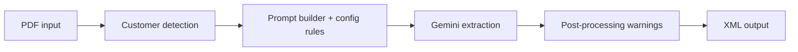

# PDF Technical Drawing Extractor

Welcome to the project documentation for the ALES PDF extraction workflow.

This CLI extracts structured manufacturing data from technical drawing PDFs using Google Gemini or local Ollama models and writes production-ready XML.

## What you can do with this tool

- Extract part number, material, coating, holes, and tolerated lengths
- Run single-file or batch processing on customer order folders
- Auto-detect customer-specific extraction behavior
- Switch backend provider (`gemini` or `ollama`) from the CLI
- Generate operator warnings and XML output for downstream systems

!!! note "Production focus"
    This project is optimized for ELTEN and Rademaker manufacturing drawings.

## High-level flow

## Documentation map

- Start quickly: [Getting Started](guides/getting-started.md)
- Run real workloads: [Usage](guides/usage.md)
- Build standalone binary: [Build & Distribution](guides/build-and-distribution.md)
- Understand internals: [Architecture](reference/architecture.md)
- Tune extraction behavior: [Configuration](reference/configuration.md)
