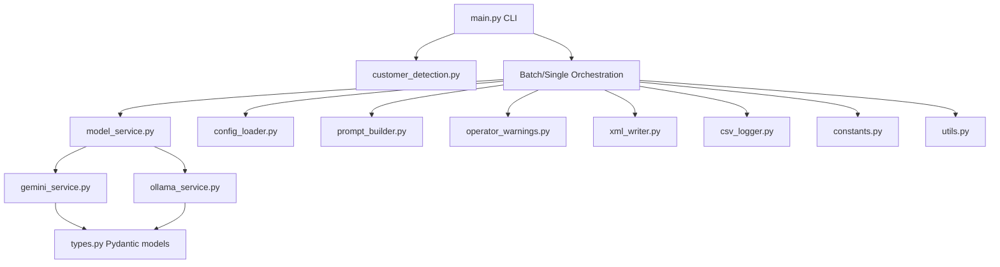
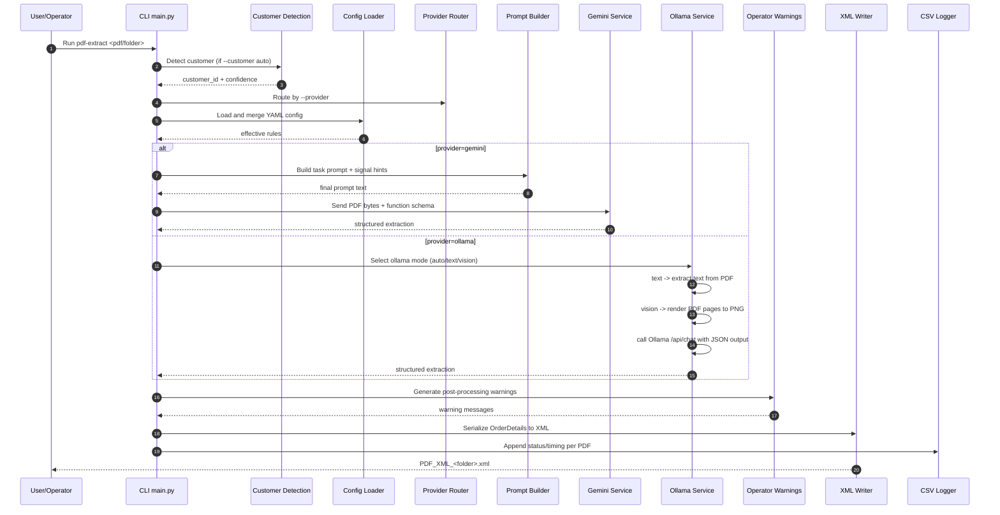
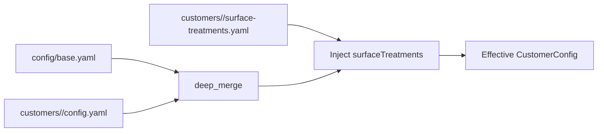
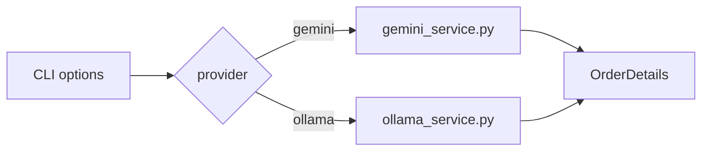
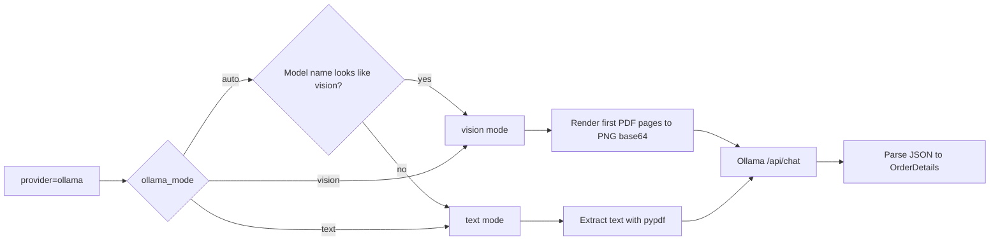
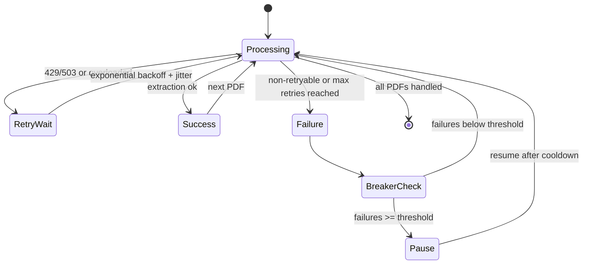
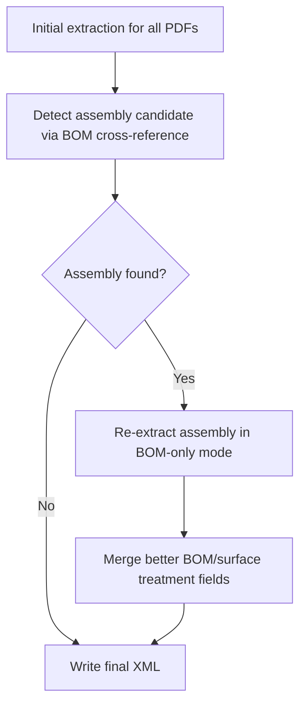

# Architecture

This page explains how data moves through the extractor, how configuration is resolved, and how reliability controls work during production batch runs.

## Component map

## End-to-end extraction flow

## Configuration resolution

Notes:

- Customer lists replace base lists (not append), preventing mixed regex behavior.
- `surface-treatments.yaml` is injected after base+customer merge to keep customer coating vocab explicit.

## Provider routing

Notes:

- Gemini path uses native PDF vision + function calling.
- Ollama path supports text and vision mode via local chat API JSON output.
- In Ollama mode, customer auto-detection falls back to `base`.

## Ollama mode pipeline

## Batch reliability control flow

## Assembly two-pass logic

